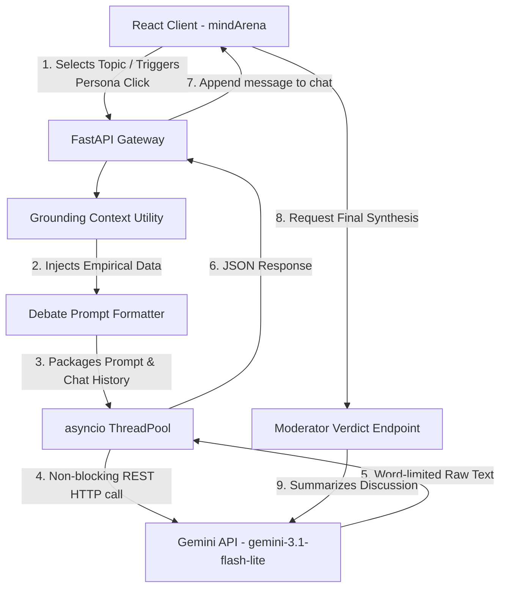

# mindArena

An elegant, real-time AI group-chat debate simulator that models high-fidelity, multi-perspective discussions. Unlike standard chatbot applications, **mindArena** acts as a simulation cockpit where three distinct virtual Indian personas—representing contrasting viewpoints—engage in a conversational debate on a topic of the user's choosing, culminating in an objective verdict by a neutral Moderator.

---

## 🏛️ Project Architecture



The system is engineered as two decoupled modules:
1. **Frontend**: A React single-page application powered by Vite and Tailwind CSS. It is built around a centralized dashboard displaying active perspectives, an invisible scrollable chat feed, and a moderator control dock.
2. **Backend**: A FastAPI ASGI server that processes incoming conversation states, matches topic keywords to static research grounding databases (a lightweight localized RAG), constructs system prompts, and routes requests to the Gemini API.

---

## 🗂️ Clean Folder Structure

The project has been minimized to contain only the essential, high-performance files required to run the simulation:

```
project/
├── backend/
│   ├── .env                    # Local environment secrets (GEMINI_API_KEY)
│   ├── main.py                 # FastAPI routing definitions and startup configuration
│   ├── requirements.txt        # Backend dependencies (fastapi, uvicorn, google-generativeai, python-dotenv)
│   ├── prompts/
│   │   └── templates.py        # System prompt instructions and strict formatting constraints
│   ├── services/
│   │   └── debate_orchestrator.py # Gemini REST configurations, retry logic, and history formatters
│   └── utils/
│       └── grounding.py        # Keyword-based RAG grounding database
│
└── frontend/
    ├── index.html              # HTML gateway (page title set to mindArena)
    ├── package.json            # React & Vite packages, dev/build scripts
    ├── tailwind.config.js      # Tailwind CSS configuration rules
    └── src/
        ├── main.jsx            # React client mount root
        ├── App.jsx             # Shell wrapper, centered capsule header, and footer layout
        ├── index.css           # Global typography, gradients, and custom scrollbar overrides
        ├── pages/
        │   └── DebateDashboard.jsx # Primary simulation view (chat window, buttons, state logic)
        └── services/
            └── api.js          # HTTP REST client service for backend endpoints
```

---

## 🎭 Persona Definitions & Guidelines

The simulation features four highly professional virtual entities defined in [templates.py](file:///c:/Users/prasa/OneDrive/Desktop/project/backend/prompts/templates.py):
*   🧑‍🏫 **Prof. Vasundhara Sen (Senior Educator)**: Dean of Educational Studies. Empathic, warm, values human mentorship, skeptical of replacement technologies.
*   💼 **Devendra Singhania (VC & Tech Founder)**: Venture Capitalist and tech founder. Efficiency-driven, focused on scalable optimization and AI integration.
*   🎓 **Ananya Roy (Research Fellow)**: Graduate Student Council Chair. Pragmatic, focused on daily utility, workload pressure, and screen fatigue.
*   ⚖️ **Dr. Shekhar Raghavan (Policy Advisor)**: Moderator. Objective, concise, neutral, synthesizes disputes without picking a side.

---

## ⚡ Performance Optimizations (Windows & Latency)

Several architectural optimizations were implemented to resolve socket deadlocks and lower response times:
1.  **gRPC Deadlock bypass**: On Windows environments, gRPC transport conflicts with the default async `ProactorEventLoop`. We globally configured the Gemini SDK to use REST/HTTP transport via `genai.configure(transport="rest")`.
2.  **Non-Blocking API Calls**: Synchronous generative calls are wrapped inside Python's `asyncio.to_thread` executor. This delegates network requests to background thread pools, keeping FastAPI's main event loop free.
3.  **Low-Latency Model Selection**: We utilize `gemini-3.1-flash-lite`, reducing single-turn response generation times to **~2.5 seconds** while keeping daily API quota usage highly sustainable.
4.  **Invisible Scrolling Container**: The chat workspace is limited to `480px` height with `.no-scrollbar` style overrides. All messages auto-scroll inside an invisible text box, keeping the control panels static.

---

## 🚀 Installation & Setup Guide

Ensure you have **Node.js (v18+)** and **Python (v3.10+)** installed on your machine.

### 1. Backend Setup

1.  Navigate into the `backend/` directory:
    ```bash
    cd backend
    ```
2.  Create and activate a Python virtual environment:
    ```bash
    # Windows (PowerShell)
    python -m venv .venv
    .\.venv\Scripts\Activate.ps1

    # macOS/Linux
    python3 -m venv .venv
    source .venv/bin/activate
    ```
3.  Install dependencies:
    ```bash
    pip install -r requirements.txt
    ```
4.  Create your environment file:
    Create a `.env` file in the root of the `backend/` directory and input your Gemini API Key:
    ```env
    GEMINI_API_KEY=AIzaSyYourGeminiApiKeyHere
    ```
    *(Obtain a key for free from the [Google AI Studio](https://aistudio.google.com/))*
5.  Start the backend server:
    ```bash
    python main.py
    ```
    The FastAPI API will be hosted on `http://127.0.0.1:8000`.

### 2. Frontend Setup

1.  Open a new terminal session and navigate into the `frontend/` directory:
    ```bash
    cd frontend
    ```
2.  Install packages:
    ```bash
    npm install
    ```
3.  Launch the development client:
    ```bash
    npm run dev
    ```
    Vite will boot the application at `http://localhost:5173`. Open this URL in your web browser.

---

## 🎨 UI/UX Mockup Harmonization

The application is styled exactly like the original mockups (Image 1):
*   **Green/Teal Ambient Light**: A custom radial gradient glow spreads from the top center behind the application elements.
*   **Topic Header Capsule**: Centered floating capsule navbar featuring a custom glowing `Brain` icon container and a dual-tone (`mind` in cyan, `Arena` in lavender) branding label.
*   **Aura Glow debate card**: Ongoing topic card highlighted with a `shadow-[0_0_50px_rgba(20,184,166,0.06)]` gradient, double border circular pulsing question-mark icon, and monospaced action controls.
*   **Dynamically glowing speakers**: Cards glow borders based on which persona spoke last or is currently thinking.
*   **Conversation Bubbles**: Styled chat bubbles (amber for Prof. Sen, cyan for Mr. Singhania, purple italicized for Ms. Roy, and dashed white borders for the final Moderator synthesis).
